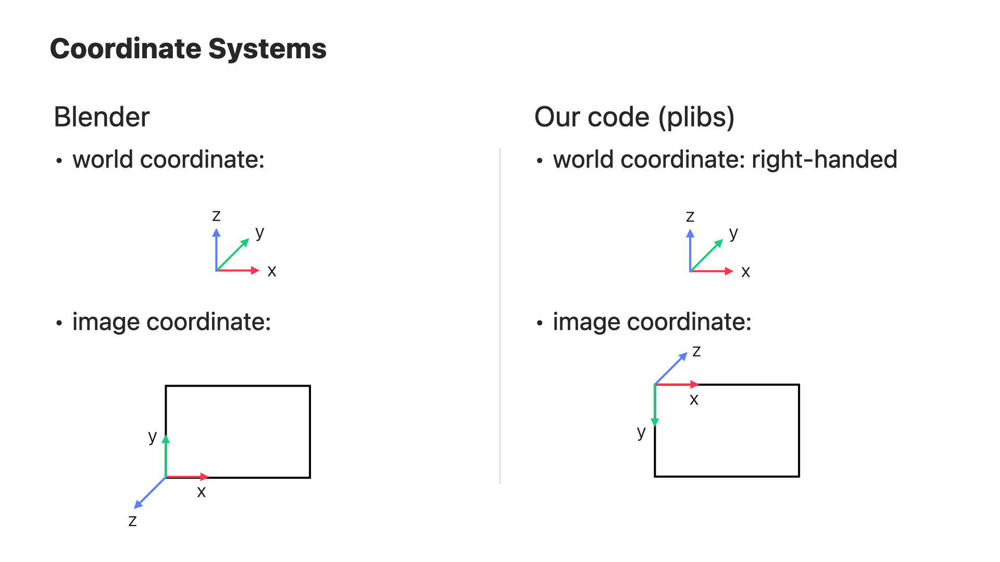

# Configurable blender rendering 
[Please message Rick Chang for questions]

This library provides an easy way to programmably configure a scene, 
including the meshes, lighting, and camera poses, and 
then render the scene with blender. 

## Main function 
The main function is [blender_utils_v3.render_json](blender_utils_v3.py), 
which takes a json configuration describing how meshes, lights, and cameras 
should be placed in the scene. 

See the example json file [example_config.json](example_config.json) or [example_config.yaml](example_config.yaml).

## Example usage
Remember to clone/pull the submodule.  
`git clone --recurse-submodules git@github.pie.apple.com:jenhao-chang/blender_rendering.git`

The library is tested on both linux and Mac.  
It downloads blender automatrically on Linux; on Mac, you need to 
install Blender yourself. We by default use Blender 4.2.0. 

Checkout the [example notebook](test_blender_rendering.ipynb) that goes through
scene creation, rendering, and reading the rendered RGBD results.

[tests/test_render_save_and_load.ipynb](tests/test_render_save_and_load.ipynb) shows how to 
render and then load the rendered results into our plibs `structures.RGBDImage`. 

--- 

## Config structure

The config is composed of the following fields:

- **cycles_settings**:

    dict. It controls the cycles renderer's behavior, including 
    the number of samples per pixel, number of light bounces. 
    It is passed as arguments to `setup_blender_cycles()`. 
- **view_layer_settings**:

    dict. It controls what outputs (depth, normal, etc) should be rendered.
    It is passed as arguments to `setup_blender_view_layers()`.
- **mesh_dicts**:

    list of dict, (num_meshes,). It contains the meshes to be put 
    into the scene and controls how they are put. Each dict is passed 
    as arguments to `read_mesh()`.
- **camera_dicts**:

    list of list of dict, the outer list has length (num_frames,),
    and the inner list has length (num_views,).  Each of the dict 
    contains camera information (eg, intrinsic and camera pose in Blender's coordinate system).
    Each dict is passed as arguments to `read_camera()`.
- **light_dicts**:

    list of dict, (num_lights,). It controls the type of lights and how 
    to place them into the scene. Each dict is passed as arguments to `read_lighting()`.

---

## Coordinate system
Here is a quick overview of blender's coordinate system and ours. 

#### World coordinate system used by blender
Right-handed. Blender's convention is z axis to up, x to right, y to far. 

#### Image coordinate system used by blender
The image coordinate is right-handed:  x to right of image, y to top of image, z to us, and 
the origin is the bottom left corner of the image. 

The camera looks at -z_c and the up of the image is +y_c. 
The origin of the camera coordinate is at the bottom left of the image corner. 

Even though the camera looks at -z_c, the depth map (z_c) returned by the renderer
is always positive

#### World coordinate system of our code
Right-handed: We follow imported scene, ie, we do not rotate the world coordinate.  

#### Image coordinate system of our code
Right-handed:  x to right of image, y to bottom of image, z to far.  

The origin of the camera coordinate is at the top left of the image corner. 
The camera looks toward +z_c, which is different from blender camera convention. 