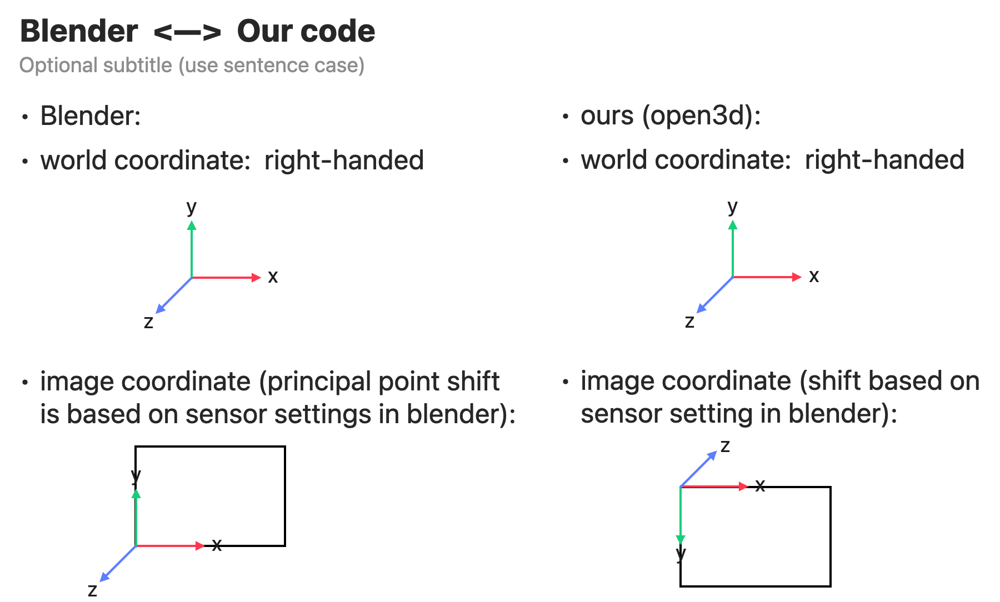

# Pointersect Library
[Please message Rick Chang for questions]

The library contains various utility functions that we developed 
for interacting with mesh, uv map, point cloud, camera, rendering, etc.

### Basic usage
Here is a very brief description of the library: 

- [structures.py](structures.py) contains the data structures like mesh, point cloud, RGBD image, Camera, etc.
- [utils.py](utils.py) contains functions like pinhole projection, pinhole backprojection, etc.
- [rigid_motion.py](rigid_motion.py) contains functions related to homogeneous matrices and camera poses.
- [bolt_utils.py](bolt_utils.py) contains functions to download from bolt, blobby, conductor.

### Coordinate system
We use Open3D's coordinate system, which is x to right, y to up, z to us 
for world cooditnate. For image coodinate, the origin is the top left corner,
with x to righ, y to bottom, z to far. See the image. 

